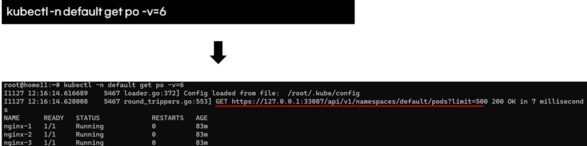

# 테라폼 언어(HCL 구조

테라폼 코드는 HCL라는 언어로 작성합니다. HCL은 Block이라는 기본단위를 사용합니다. 결국, 테라폼 코드는 Block단위의 집합입니다.

<figure><figcaption></figcaption></figure>

Block은 Meta-argument와 Expression으로 구성됩니다. Meta-arguments는 각 Block의 인자이고 공통 arguments와 Block마다 고유한 argument가 있습니다. argument가 아닌 일반 설정을 Expressions이라고 부릅니다.

<figure><figcaption></figcaption></figure>

Block의 Meta-arguments는 공식문서([https://developer.hashicorp.com/terraform/language](https://developer.hashicorp.com/terraform/language))에서 찾을 수 있습니다.

<figure><figcaption></figcaption></figure>
