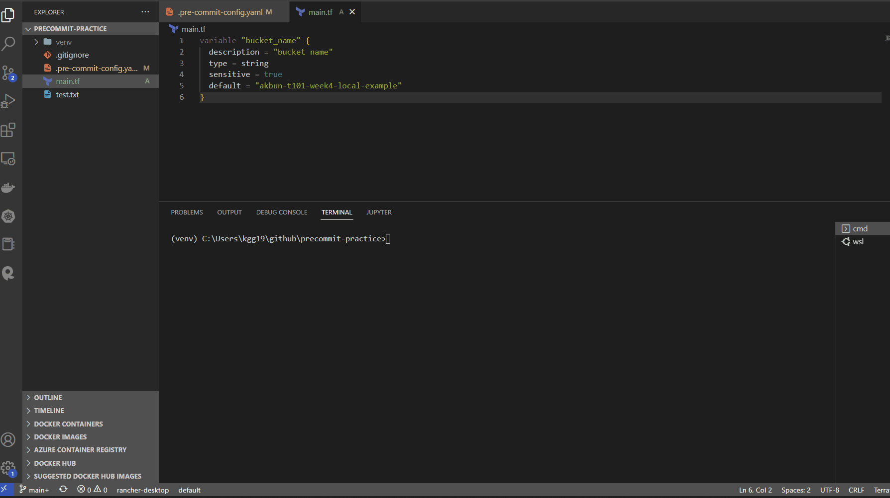
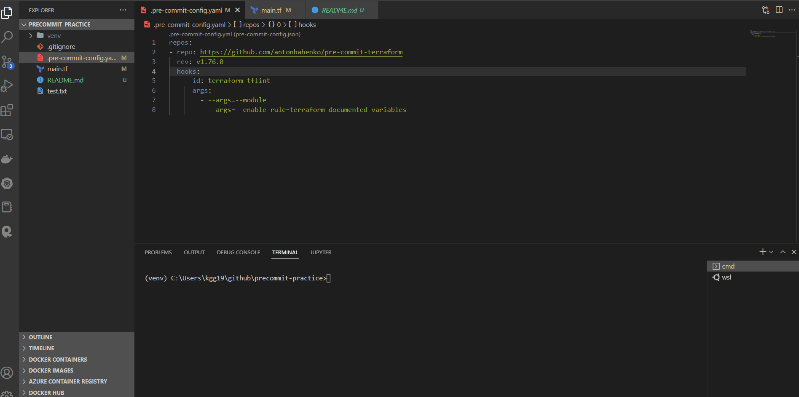
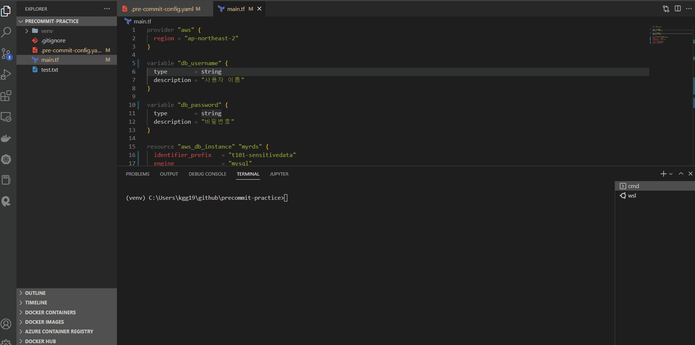

# terraform pre-commit

## 개요

<mark style="color:red;">terraform pre-commit은 테라폼과 관련된 python pre-commit플러그인</mark>입니다. 테라폼 코드 보안, lint 등 검사를 commit전에 검사합니다. 검사를 통과하지 못하면 commit이 실패하지만 자동으로 통과하지 못한 코드를 수정합니다.


terraform pre-commit을 사용하려면 .pre-commit-config.yaml파일에 아래처럼 설정하면 됩니다. id필드에 사용할 hook목록을 설정합니다. hook목록은 공식문서([https://github.com/antonbabenko/pre-commit-terraform#available-hooks](https://github.com/antonbabenko/pre-commit-terraform#available-hooks))에서 볼 수 있습니다.

```yaml

repos:
- repo: https://github.com/antonbabenko/pre-commit-terraform
  rev: <VERSION> # Get the latest from: https://github.com/antonbabenko/pre-commit-terraform/releases
  hooks:
    - id: terraform_fmt
    - id: terraform_docs
```


## terraform\_fmt&#x20;

테라폼 코드를 예쁘게 포맷팅합니다. .pre-commit-config.yaml설정은 아래와 같습니다.

```yaml
repos:
- repo: https://github.com/antonbabenko/pre-commit-terraform
  rev: v1.76.0
  hooks:
    - id: terraform_fmt
```


indent가 정렬되지 않는 상태에서 git commit명령어를 실행하면 terraform\_fmt hook이 자동으로 indent설정을 합니다.

<figure><figcaption></figcaption></figure>

## terraform\_tflint

사용하지 않는 코드 등을 검사하는 lint입니다. 바이너리 설치가 필요합니다.

```shell
# window
choco install tflint

# linux
curl -s https://raw.githubusercontent.com/terraform-linters/tflint/master/install_linux.sh | bash

# mac
brew install tflint
```


.pre-commit-config.yaml설정은 아래와 같습니다.

```yaml
repos:
- repo: https://github.com/antonbabenko/pre-commit-terraform
  rev: v1.76.0
  hooks:   
    - id: terraform_tflint
      args:
        - --args=--module
        - --args=--enable-rule=terraform_documented_variables
```


예제로 사용하지 않은 variable가 있는 파일을 git commit했습니다. 사용하지 않는 variable이 있다고 commti을 실패합니다.

<figure><figcaption></figcaption></figure>


## Terraform docs

테라폼 코드를 해석하여 문서를 작성하는 hook입니다. 바이너리 설치가 필요합니다.

```shell
# window
choco install terraform-docs

# linux
curl -Lo ./terraform-docs.tar.gz https://github.com/terraform-docs/terraform-docs/releases/download/v0.16.0/terraform-docs-v0.16.0-$(uname)-amd64.tar.gz
tar -xzf terraform-docs.tar.gz
chmod +x terraform-docs
mv terraform-docs /usr/local/terraform-docs

# mac
brew install terraform-docs
```


.pre-commit-config.yaml설정은 아래와 같습니다.

```yaml
repos:
- repo: https://github.com/antonbabenko/pre-commit-terraform
  rev: v1.76.0
  hooks:
    - id: terraform_docs
      args:
        - --hook-config=--path-to-file=README.md        # Valid UNIX path. I.e. ../TFDOC.md or docs/README.md etc.
        - --hook-config=--add-to-existing-file=true     # Boolean. true or false
        - --hook-config=--create-file-if-not-exist=true # Boolean. true or false
```


테라폼 예제코드는 variable, aws\_db\_instance를 사용했습니다.

```hcl
provider "aws" {
  region = "ap-northeast-2"
}

variable "db_username" {
  type        = string
  description = "사용자 이름"
}

variable "db_password" {
  type        = string
  description = "비밀번호"
}

resource "aws_db_instance" "myrds" {
  identifier_prefix   = "t101-sensitivedata"
  engine              = "mysql"
  allocated_storage   = 10
  instance_class      = "db.t2.micro"
  skip_final_snapshot = true

  db_name  = "sensitive_example"
  username = var.db_username
  password = var.db_password
}
```


git commit을 실행하면 README.md문서가 자동으로 생성됩니다.

<figure><figcaption></figcaption></figure>
