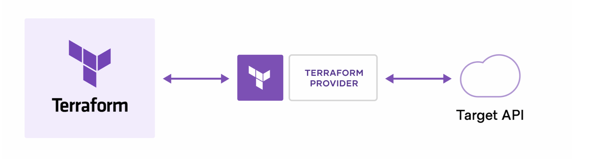

# kubectl로 쿠버네티스 API검색




쿠버네티스 API를 사용할 때, 공식문서를 참조하여 어떤 API를 어떻게 써야하는지 찾기 매우매우 어렵습니다. 문서 내용이 너무 많아 API를 찾기 힘듭니다.

<figure><figcaption></figcaption></figure>


다행히, <mark style="color:red;">kubectl verbose모드로 쿠버네티스 API를 쉽게 찾을 수 있습니다.</mark> 예를 들어 default namespace에 있는 pod API를 찾으려면 아래처럼 찾으면 됩니다.

```
kubectl -n default get po -v=6
```

<figure><figcaption></figcaption></figure>


API 파라미터를 포함한 API도 쉽게 kubectl verbose로 찾을 수 있습니다.

<figure><figcaption></figcaption></figure>


찾은 API를 curl명령어를 이용하여 호출하면!! API호출 결과를 받을 수 있습니다. 물론, 쿠버네티스 인증에 대한 설정이 필요합니다.

<figure><figcaption></figcaption></figure>


프로그래밍 언어에서도 그대로 API를 사용할 수 있습니다. 아래 그림은 python으로 API를 호출한 결과입니다.


코드링크: [https://github.com/sungwook-practice/kubernetes-pythonsdk/blob/main/pods/restapi.py](https://github.com/sungwook-practice/kubernetes-pythonsdk/blob/main/pods/restapi.py)


<figure><figcaption></figcaption></figure>
