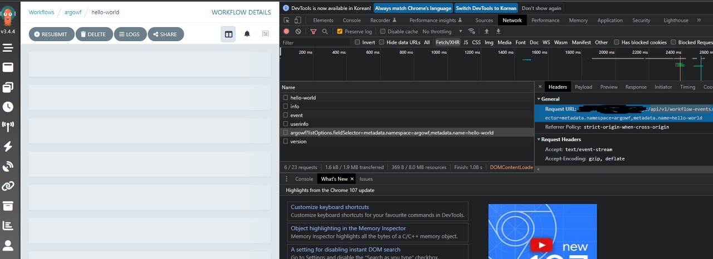

# 장애해결

## /api/v1/workflow-events API pending

### 이슈내용

argoworkflow 조회에서 workflow-events가 pending상태

<figure><figcaption></figcaption></figure>

### 해결방법

proxy를 사용하는 경우 <mark style="color:red;">proxy버퍼링 옵션을 비활성화</mark> 해야 합니다. 저는 argoworkflow를 조회하기 위해 nginx(ingress controller아님)를 거치기 때문에 오류가 발생했습니다. nginx는 proxy\_buffering옵션으로 버퍼링을 비활성화 했습니다.

```nginx
server {
  listen 80;
  server_name localhost;
 
  location / {
    proxy_buffering off;
    ...
  }
}
```
